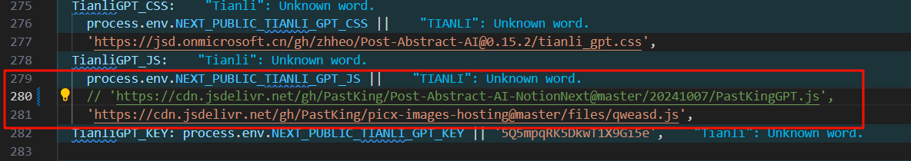

本项目为 **NotionNext** 博客提供了基于 `OpenAI API` 的文章摘要功能。以下是如何配置和使用该功能的步骤说明。
## 使用教程
### 克隆本项目到自己的GitHub仓库

1. 在 GitHub 页面中，点击右上角的 Fork 按钮，将项目克隆到自己的 GitHub 账户下。

2. 修改项目中的第 156 行，替换为你自己的后端请求地址。


### 代理代码
通过以下 URL 来代理你的 js 代码：

```ruby
https://cdn.jsdelivr.net/gh/用户名/Post-Abstract-AI-NotionNext/@master/pastking_gpt.js
```

替换 `用户名` 为你的 GitHub 用户名。

### 修改NotionNext
在 `NotionNext` 项目的环境变量中，修改 `NEXT_PUBLIC_TIANLI_GPT_KEY` 属性，随意填写一个值（例如：`5Q5mpqRK5DkwT1X9Gi5e`）。

替换原有的 `NEXT_PUBLIC_TIANLI_GPT_JS` 属性。



保存更改后即可启动 AI 摘要功能。

---

后端符合下面的API文档即可
## 请求相关说明

### `POST /api/summary`

#### 请求

- **方法**: `POST`
- **路径**: `/api/summary?token=<TOKEN>`
- **头部**:
  - `Content-Type`: `application/json`
  - `Authorization`: `Bearer <TOKEN>`（与环境变量 `env.TOKEN` 中的令牌匹配）

- **请求体**（JSON）:
  ```json
  {
    "content": "<your_content_here>"
  }
  ```
  - `content`: 需要生成摘要的文本内容。

#### 响应

- **状态码**: `200 OK`
- **Content-Type**: `application/json`
- **响应体**:
  ```json
  {
    "summary": "<generated_summary>"
  }
  ```
  - `summary`: 生成的内容摘要（中文，最多 200 字）。

## Cloudflare Workers实现
```JavaScript
function addHeaders(response) {
	response.headers.set('Access-Control-Allow-Origin', '*')
	response.headers.set('Access-Control-Allow-Credentials', 'true')
	response.headers.set(
		'Access-Control-Allow-Methods',
		'GET,HEAD,OPTIONS,POST,PUT',
	)
	response.headers.set(
		'Access-Control-Allow-Headers',
		'Origin, X-Requested-With, Content-Type, Accept, Authorization',
	)
}
async function sha256(message) {
	// encode as UTF-8
	const msgBuffer = await new TextEncoder().encode(message);
	// hash the message
	const hashBuffer = await crypto.subtle.digest("SHA-256", msgBuffer);
	// convert bytes to hex string
	return [...new Uint8Array(hashBuffer)]
		.map((b) => b.toString(16).padStart(2, "0"))
		.join("");
}
export default {
	async fetch(request, env, ctx) {
		const url = new URL(request.url);
		if (url.pathname.startsWith('/api/summary')) {
			let response
			if (request.method == 'OPTIONS') {
				response = new Response('')
				addHeaders(response)
				return response
			}
			if (request.method !== 'POST') {
				return new Response('error method', { status: 403 });
			}
			if (url.searchParams.get('token') !== env.TOKEN) {
				return new Response('error token', { status: 403 });
			}
			let body = await request.json()
			const hash = await sha256(body.content)
			const cache = caches.default
			let cache_summary = await cache.match(`http://objects/${hash}`)
			if (cache_summary) {
				response = new Response(
					JSON.stringify({
						summary: (await cache_summary.json()).choices[0].message.content
					}),
					{ headers: { 'Content-Type': 'application/json' } },
				)
				addHeaders(response)
				return response
			}
			const cache_db = await env.DB.prepare('Select summary from posts where hash = ?').bind(hash).first("summary")
			if (cache_db) {
				response = new Response(
					JSON.stringify({
						summary: cache_db
					}),
					{ headers: { 'Content-Type': 'application/json' } },
				)
				addHeaders(response)
				ctx.waitUntil(cache.put(hash, new Response(
					JSON.stringify({
						choices: [
							{
								message: {
									content: cache_db,
								}
							}
						]
					}),
					{ headers: { 'Content-Type': 'application/json' } },
				)))
				return response
			}
			const init = {
				body: JSON.stringify({
					"model": env.MODEL,
					"messages": [
						{
							"role": "system",
							"content": "你是一个摘要生成工具,你需要解释我发送给你的内容,不要换行,不要超过200字,不要包含链接,只需要简单介绍文章的内容,不需要提出建议和缺少的东西,不要提及用户.请用中文回答,这篇文章讲述了什么?"
						},
						{
							"role": "user",
							"content": body.content
						}
					],
					"safe_mode": false
				}),
				method: "POST",
				headers: {
					"content-type": "application/json;charset=UTF-8",
					"Authorization": env.AUTH
				},
			};
			const response_target = await fetch(env.API, init);
			const resp = await response_target.json()
			response = new Response(
				JSON.stringify({
					summary: resp.choices[0].message.content
				}),
				{ headers: { 'Content-Type': 'application/json' } },
			)
			ctx.waitUntil(cache.put(`http://objects/${hash}`, response_target))
			await env.DB.prepare('INSERT INTO posts (hash, summary) VALUES (?1, ?2)').bind(hash, resp.choices[0].message.content).run()
			addHeaders(response)
			return response
		}
		return new Response('Hello World!');
	},
};
```
---

